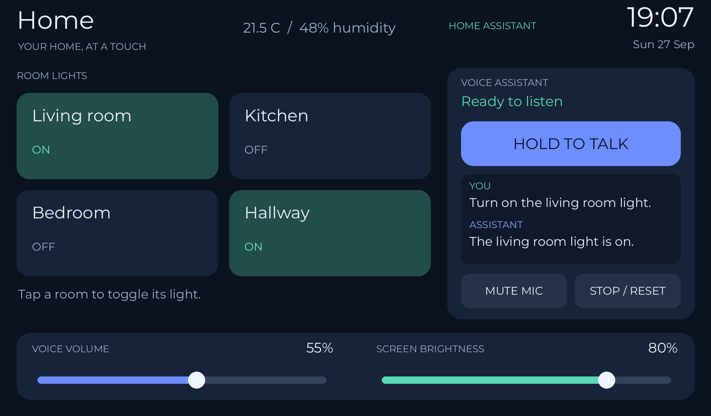

# Guition voice panel

An ESPHome configuration that turns the **Guition JC1060P470C_I_W_Y** (7-inch 1024 × 600 touchscreen, ESP32-P4 + ESP32-C6, ES8311 audio) into a Home Assistant wall panel with push-to-talk Assist.



*Layout mock-up rendered from the YAML widget positions. The time, readings, light states and conversation are sample values, not a photo of a running device.*

## Features

- Four light tiles with live on/off state from Home Assistant
- Clock and date (Europe/London), plus optional indoor temperature and humidity
- Hold-to-talk voice control through a Home Assistant Assist pipeline, with the recognised text and reply shown on screen
- **Panel audio** media player for Assist replies, TTS, HTTP audio and Sendspin / Music Assistant music
- Voice volume and screen brightness sliders, also exposed to Home Assistant
- Microphone mute (retained across restarts), Stop/Reset, and a 3-second hold to restart
- Wired Ethernet preferred, with automatic Wi-Fi fallback
- Screen dims to 15% after two minutes idle; touch restores it

## Requirements

- ESPHome **2026.9.0 or later** (built-in components and fonts only; no external packages)
- Home Assistant with the ESPHome integration and an Assist pipeline (STT, conversation agent, TTS)
- Optional: a Sendspin server such as Music Assistant for music playback

## Quick start

1. Copy `guition-voice-panel.yaml` into your ESPHome config directory (usually `/config/esphome/`).
2. Merge `secrets.example.yaml` into your `secrets.yaml` and fill in the values. Generate the API key with `openssl rand -base64 32`.
3. Edit the `substitutions` at the top of the YAML: room names, light entity IDs and temperature/humidity sensors. The shipped IDs are placeholders.
4. Check the ESP32-P4 silicon revision in the boot log: keep `p4_engineering_sample: "true"` for revisions below v3.0, set `"false"` for v3.0 or later.
5. Flash the first time over USB to the P4 port, then over the network afterwards:

   ```bash
   esphome config guition-voice-panel.yaml
   esphome run guition-voice-panel.yaml
   ```

6. In Home Assistant, add the device, enable **Allow the device to perform Home Assistant actions**, and choose the Assist pipeline for it.

## Documentation

- [`Guition-Setup.md`](Guition-Setup.md): full setup guide, covering push-to-talk use, the media player, Sendspin, networking, the pin table and troubleshooting.
- [`SKILLS.md`](SKILLS.md): engineering notes on the design decisions that aren't obvious, such as push-to-talk release behaviour, handing the shared I²S bus between microphone and speaker, the media-player and Sendspin setup, and Ethernet failover. Each note has its source evidence and regression checks.

## Status

The configuration passes schema validation and a full ESP32-P4 build on ESPHome 2026.9.0 / ESP-IDF 5.5.5. Some behaviour still needs confirming on real hardware: the push-to-talk and audio handoff fixes, Sendspin playback, and Ethernet/Wi-Fi failover.
